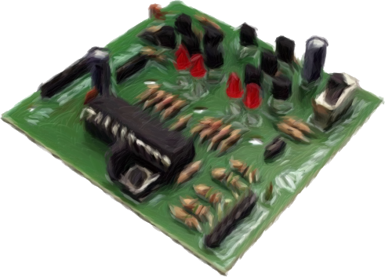
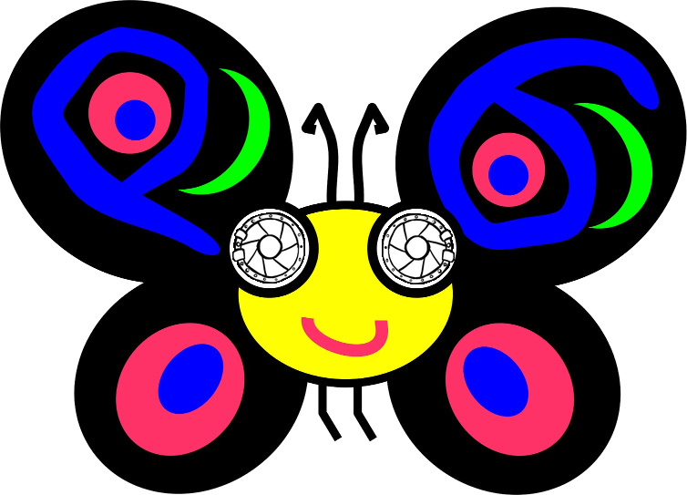

# On the wings of Mr. Butterfly

## Introductions

One day, the Twins were journeying in the valley, and came across a strange
glade: while the forest around it was all green, full of birds and wildlife, the
glade felt... too calm. While the surroundings were filled by the songs of
birds, and the rustle of tree leaves, the glade was all but silent. They could
hear a faint buzzing sound coming from the birdbath - a hollow stone, really -,
but otherwise it was just silence. While such silence could have been scary,
they felt tranquility: the kind we feel before we figure out a great idea, and
get enlightened. This was the most fascinating part of the glade: it did not
only look stunning in its simplicity, it soothed their minds too.

"*Curious.*" - he said, and they sneaked closer to the birdbath, watching every
step, to not make any noise. Within the birdbath, they saw no birds having fun,
but a butterfly basking in the sun. "*Oh, hello there, children!*" - it said,
and they looked at it with eyes wide open. A talking butterfly! They have seen
strange things during their many adventures, but a talking butterfly was
something new. "*Don't be afraid, I don't bite.*" - the little creature
continued. They stepped closer and saw that the butterfly was no ordinary
creature, nor was it basking in the sun after all! It held a tiny magnifying
glass in its tiny hands, outsized goggles over its eyes, and it was soldering
something by collecting the rays of the sun with the magnifier. "*Are you two
just going to stand there, or will you help me fix this thing?*" - it asked,
seeing the dumbfounded look on the Twins' faces. They stepped closer to see what
the *thing* the butterfly talked about was. Silver and gold lines ran across a
green plate, little knobs stuck out of it from here and there, in numerous
shapes and forms. Never have they seen anything like it before.

 

"*How can we help?*" - she asked. "*Hold this board for me, will you?*" - the
butterfly replied, and so she did. The creature then flew round the device and
furiously soldered with its magnifying glass for a good few minutes. Then it
landed on the birdbath, and exhausted, it exclaimed: "*Phew! This was a hard
one. Thank you for your help, kids, Mr. Mouse will be very happy!*". "*Excuse me
sir, but who are you, who is Mr. Mouse, what were you doing, and why, and what
is this board and how can you talk and..." - they asked in tandem, many
questions at the same time.

 

"*Oh, forgive me! Where did I leave my manners?! I am Mr. Butterfly. I used to
grow pumpkins, and was even elected Pumpking at one point. But nowadays I'm
creating keyboards.*" - the butterfly noted, then continued: "*You have many
questions, I see, and I will happily explain everything in due time, but now I
must hurry and bring this device to Mr. Mouse, he is eagerly expecting it.*".
Then Mr. Butterfly paused for a moment, and concluded: "*You know what? Come
with me, and Mr. Mouse can thank you in person for helping me! We'll have some
tea and bagels, and proper introductions. What say you?*"

<!-- TODO: A picture of the twins thinking together -->

The Twins put their head together, and figured they may aswell visit this
mystical mouse. They were both incredibly curious about what just happened.
"*Lead the way, Mr. Butterfly!*" - they finally answered, and followed the
butterfly to the home of Mr. Mouse.
