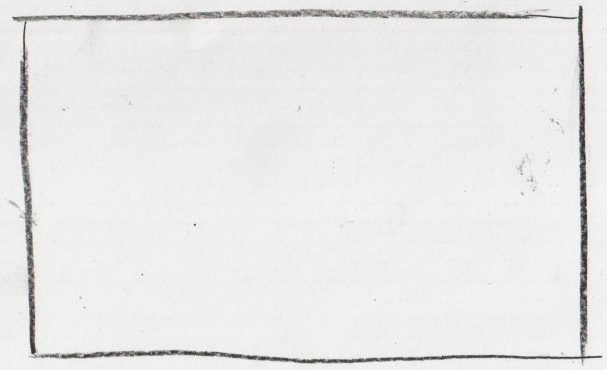

## Down the rabbit hole

"*What we have here is a keyboard, a very special one.*" - Mr. Mouse said, then
continued: "*It's just a bit of electronics now, but we'll add a little bit of
magic we call the `firmware`, and it will be able to do wonders! I hope you are
prepared for a great adventure, kids!*" - and prepared they were, or so they
thought. The Twins sat beside Mr. Mouse, who leaned forward, plugged the new
device in, and started typing on one of his other keyboards furiously with his
little paws. Meanwhile Mr. Butterfly sat on the back of his chair.

 <!-- TODO -->
 

A few minutes later, Mr. Mouse paused, and asked the Twins: "*In all this
excitement, I forgot to ask you: do you wish to see what we've been up to with
Mr. Butterfly? Or are we boring you?*". The Twins immediately expressed their
desire to see what their hosts have been working on, and so Mr. Mouse continued:
"*Splendid! We'll start from the beginning, so you can do this at home too,
would you want to!*".
